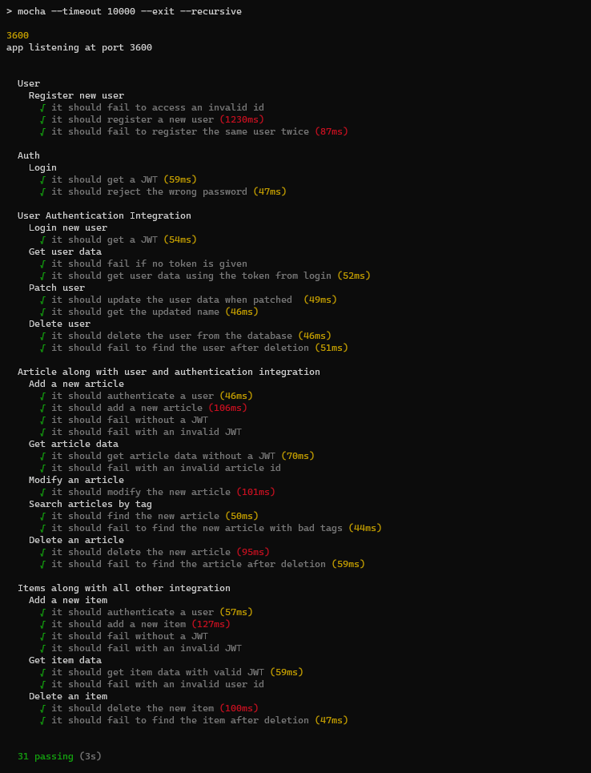

## Testing
   Tests were set up on the API side using the Mocha and Chai node modules.   
   After installing all the node modules using `npm install` in [/API-NodeJS](../API-NodeJS), running `npm test` in the same folder will run all the unit and integration tests with output into the console.   
   No logs were taken of these tests as there was no easy way to generate and manage them, but the tests are easy and quick to run at any time.   
   Currently there are 31 unit and integration tests all verifying the accurate functionality of the API, and they are all passing in the current build as seen in the following output screenshot. 
    
   
