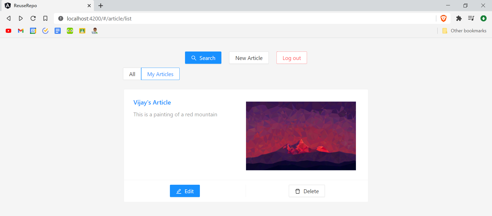
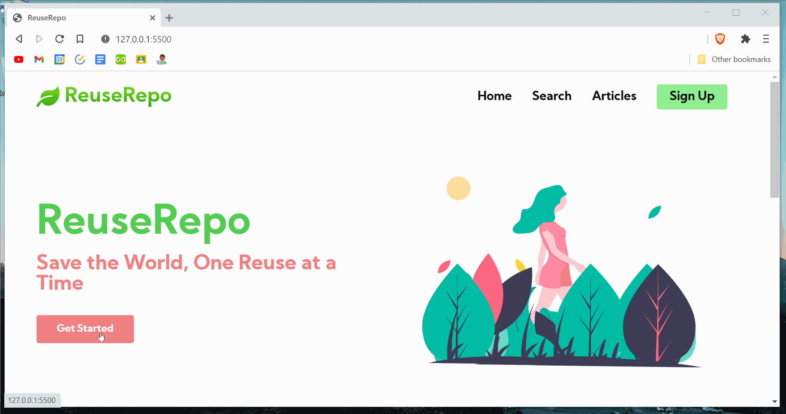
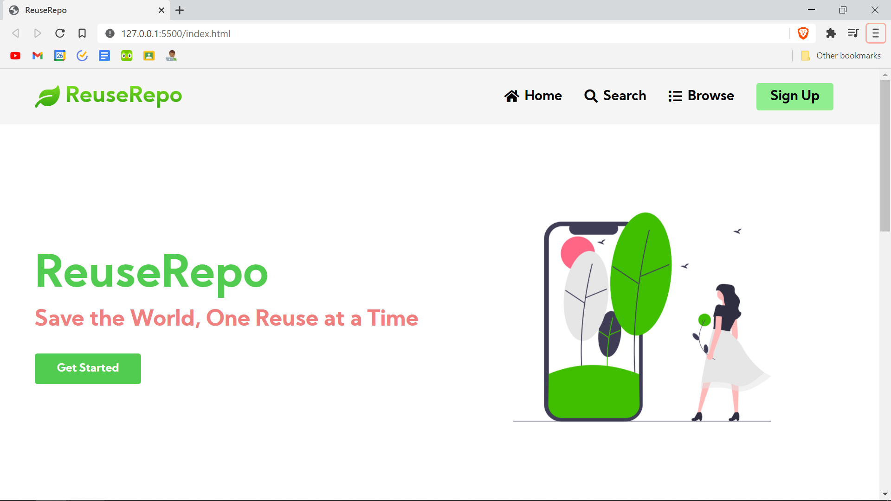
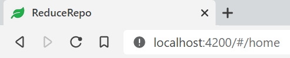
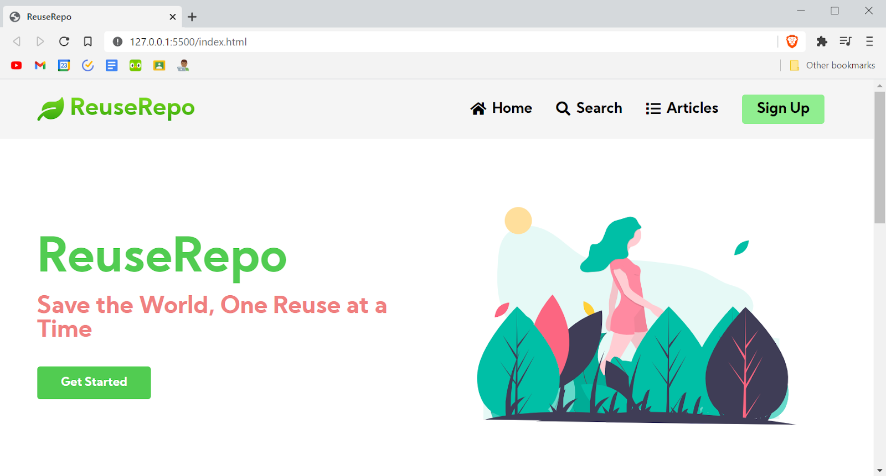
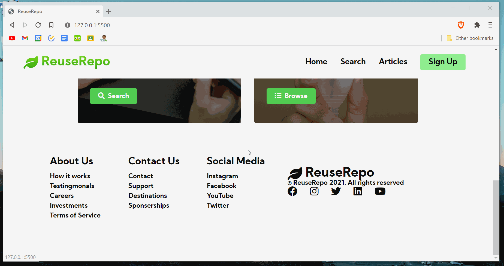
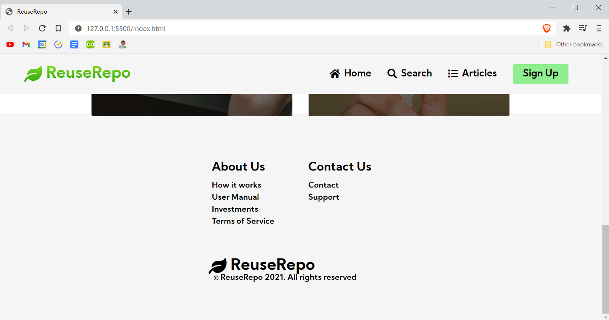
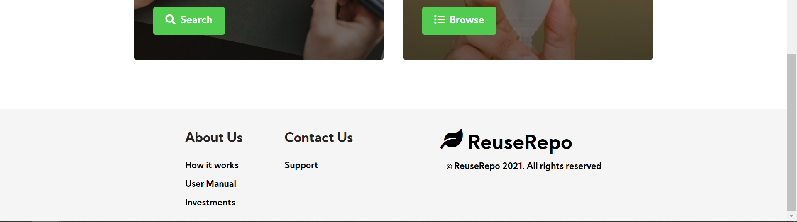

## 1. UI (Angular + Material Design Skin)
   The application uses an out of the box Angular and Material Design skin. We used angular cli ng commands to spawn the project.
   See details on how to start up in [/UI-Angular/README.md](UI-Angular/README.md)
   
   ### Homepage
   
   [VP] Added thumbnails for articles that have images
   
    
   
   [VP] Upgraded Home Page with dynamic navbar (now responsive to resizing)
   
   
   
   [VP] Services cards to navigate (responsive to resizing)
   
   
   
   [VP] Changed the homepage image
   
   
   
   [VP] Added a leaf icon to the tab
   
   
   
   ### Navbar
   
   [VP] Added icons to the navbar
   
   
   
   ### Footer
   
   [VP] Added footer (responsive to resizing)
   
   
   
   [VP] Removed social media section and media icons, moved the website rights to the bottom
   
   
   
   [VP] Made the footer slimer and moved the website rights to the right
   
   
   

### 2. API (NodeJS and ExpressJS)
   [AK] Created a shell API using NodeJS by following this [example](https://www.toptal.com/nodejs/secure-rest-api-in-nodejs)  
   
    Use following commands to run it  
        - npm install  
        - npm start  
    This will start the API server on port 3600. 
 
### 3. Datastore (Cosmos DB with Mongos API)
   [AK] Created an out of the box MongoDB on azure using portal.azure.com
