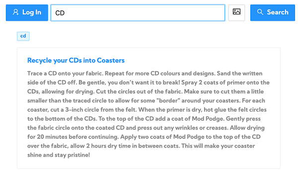
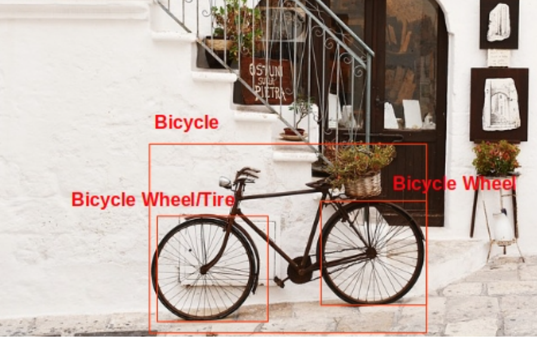
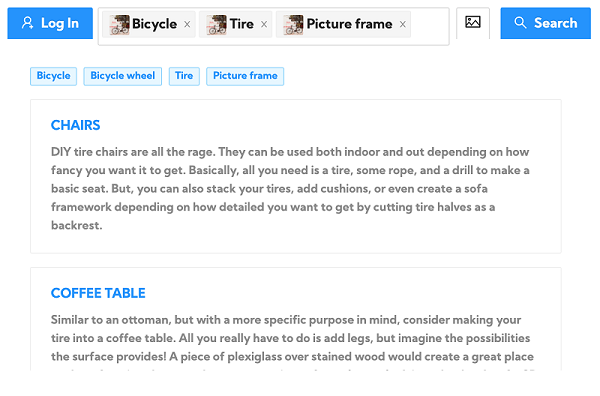
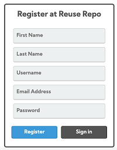
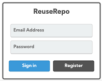
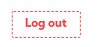
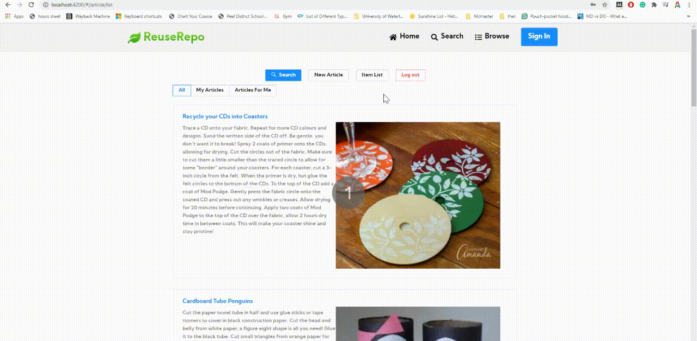

# User Manual

## Overview
We created a community website that helps people find and create ideas to reuse items which would otherwise go in the garbage or recycling. 

    

---

## Functionalities

While the web site allows anyone to search for articles, it allows registered users to create and publish articles.

## 1. Search
The articles are tagged with key words, and the user can search for reuse articles by typing in the key words in the search bar, and then clicking the search button. 

  

The web site also supports a cool feature of detecting objects off an uploaded image. This really comes handy when an item has multiple reusable components. For example, a user can upload an image of a bicycle, and the web site not only detects bicycle as one of the objects, but also detects bicycle parts such as tire etc.

   

----   

## 2. User Management

### Register
If someone likes to contribute to the community by adding content, he or she can register using the register screen. The registration does not require confirmation. The user can login right after registering.  

### Login 
The user can use the login link to log into the site to contribute to the community.  

### Logout
The site does not log out the user automatically unless the user clicks the logout button. Upon logging out, the user session is closed.  

---
## 3. Articles

### Create Article
A logged in user can create an article by clicking on `New Article`. This will take the user to an Article page where you can enter:
+ Title: A meaningful and easy to understand title.
+ Tags: List of words or phrases that people can use to search for this article. User has to press enter to convert word phrase to a tag.
+ Details: The details about how to reuse a specific item.
+ Image: Optionally, user can add a link to an image.

There is no restriction on the size of entry nor is there a required check in this version. After clicking `Create`, the article will be created.

### Update Article 
A logged in user can update his or her articles. The user can navigate to the article through any of the lists or searches.

+ Title: A meaningful and easy to understand title.
+ Tags: List of words or phrases that people can use to search for this article. User has to press enter to convert word phrase to a tag.
+ Details: The details about how to reuse a specific item.
+ Image: Optionally, user can add a link to an image. 

### Remove Article 
A logged in user can delete his or her articles. The user can navigate to the article through any of the lists or searches.  

### Article Lists
Once the user is logged in, he or she has access to three set of articles: 

+ All Articles:
This lists all the articles including the user's own articles. The user can click on a specific article to see the details of the article. If the user is the author of the article, you will have the option to edit or delete the article.

+ My Articles:
This lists all the articles written by the user when logged in. The user can click on articles to see the details, or to edit or delete the article.

+ Articles For Me:
Instead of searching for the articles every time, the user can maintain a watch list of tags and all the articles, which are tagged with the user's desired tags and will be listed here.

