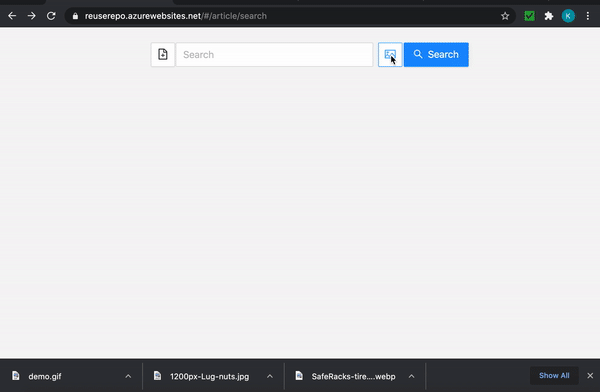

# User Manual

## Overview
We created a community website that helps people find and create ideas to reuse items those otherwise would go in the garbage or recycling. 

---

## Functionalities

While web site allows anyone to search for articles, it also allows registered user to create and publish the articles.

## 1. Search
The articles are tagged with key words and user can search for reuse articles using those. User can type the key words in search bar and hit search button. 

  

The web site also support a cool feature of detecting objects off an uploaded image. This really comes handy when an item has multiple reusable components. For example, user can upload image of a bicycle and web site not only detects bicycle as one of the objects, it also detects bicycle parts like tire etc.

   

----   

## 2. User Management

### Register
If someone like to constribute to the community by adding content, he or she can register using register screen. The registration does not require confirmation. The user can login right after registration.  

### Login 
The user use login link to log into the site to contribte to community.  

### Logout
The site does not log out the user automatically unless user clicks logout button. Upon log out, the user session is closed.  

---
## 2. Lists / Views
Once user is logged in, user has access to two set of articles 

### All Articles
This lists all the articles including user's own articles. The user can click on articles to see the details of the article. If user is the author of the article, you will have the option to edit or delet the article.

### My Articles
This lists all the articles written by logged in user. The user can click on articles to see the details, or to edit or delete the article.

### Articles For Me
Instead of searching the articles every time, user can maintain a watch list of tags and all the articles , which are tagged with user's desired tags, will be listed here.

---  

## Article Management
### Create Article
A logged in user can create article by clicking on `New Article` button. Clicking on Create button takes user to Article page where you can enter:
+ Title: A meaningful and easy to unnderstand title.
+ Tags: List of words or phrases that people can use to search for this article. User has to press enter to convert word phrase to a tag.
+ Details: The details about how to reuse a sepcific item.
+ Image: Optionally, user can add link to an image.

There is no restriction on size of entry nor there is a required check in this version.

### Update Article 
A logged in user can update his or her articles. The user can navigate to the article throuhg any of the lists or searches.

+ Title: A meaningful and easy to unnderstand title.
+ Tags: List of words or phrases that people can use to search for this article. User has to press enter to convert word phrase to a tag.
+ Details: The details about how to reuse a sepcific item.
+ Image: Optionally, user can add link to an image.

### Remove Article 
A logged in user can detele his or her articles. The user can navigate to the article throuhg any of the lists or searches.
