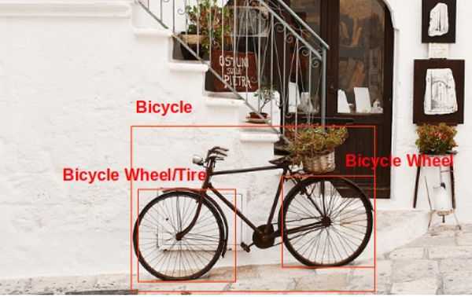

# User Manual

## Overview
We created a community website that helps people find and create ideas to reuse items which would otherwise go in the garbage or recycling. 

    

---

## Functionalities

While the website allows anyone to search for articles, it allows registered users to create and publish articles, as well as keep track of their personal list of items for easier searching.

## 1. Search
The articles are tagged with key words representing the materials needed for a project, and the user can search for reuse articles by typing in the key words in the search bar, and then clicking the search button. 

  

The website also supports a cool feature of detecting objects off an uploaded image. This really comes handy when an item has multiple reusable components. For example, a user can upload an image of a bicycle, and the web site not only detects bicycle as one of the objects, but also detects bicycle parts such as tire etc.

   

----   

## 2. User Management

### Register
If someone likes to contribute to the community by adding content, he or she can register using the register screen. The registration does not require confirmation. The user can login right after registering.  

### Login 
The user can use the login link to log into the site to contribute to the community.  

### Logout
The site keeps the user's login info in local storage until the user clicks the logout button. Upon logging out, the user data is deleted and the user will need to sign in again to access their account.  

---
## 3. Articles

Article creation features are found on the browse page.  

### Create Article
A logged in user can create an article by clicking on `New Article`. This will take the user to an Article page where you can enter:
+ Title: A meaningful and easy to understand title.
+ Tags: List of words or phrases about the necessary materials so people can search for this article. User has to press enter to convert word phrase to a tag.
+ Details: The details about how to reuse a specific item.
+ Image: Optionally, user can add a link to an image.

There is no restriction on the size of entry nor is there a required check in this version. After clicking `Create`, the article will be created.

### Update Article 
A logged in user can update his or her articles. The user can navigate to the article through any of the lists or searches.  

+ Title: A meaningful and easy to understand title.
+ Tags: List of words or phrases about the necessary materials so people can search for this article. User has to press enter to convert word phrase to a tag.
+ Details: The details about how to reuse a specific item.
+ Image: Optionally, user can add a link to an image. 

### Remove Article 
A logged in user can delete his or her articles. The user can navigate to the article through any of the lists or searches.  

### Article Lists
Once the user is logged in, he or she has access to three set of articles: 

+ All Articles:
This lists all the articles including the user's own articles. The user can click on a specific article to see the details of the article. If the user is the author of the article, they will have the option to edit or delete the article in the details page.

+ My Articles:
This lists all the articles written by the user when logged in. The user can click on articles to see the details, or to edit or delete the article.

+ Articles For Me:
Instead of searching for the articles every time, the user can maintain a list of items that they own and are looking to reuse. Any article on a project for which the user has all the required materials in their item list (meaning all the tags on the article match tags on their items) will show up in this tab. This way users can easily find ideas that fit the materials they have on hand right now without performing constnat manual searches.

## 4. Items

The item list page can be accessed from the "Item List" button on the browse page.  

The item list allows users to maintain a list of all the products they own and are looking to reuse. New items can be added with a name and tags to show what the item is and how it might be used or the materials it is made of. Old items can also be deleted so they will no longer be factored into the "Articles For Me" search. These items are saved in the user database so they will persist into the next session.  

Upon accessing the "Articles For Me" page, the website looks for articles where all the tags match the tags on a user's item list, meaning that the user already has the materials required to complete the idea in the article. Those articles are then shown to the user to make finding reusing ideas a more seamless process.

